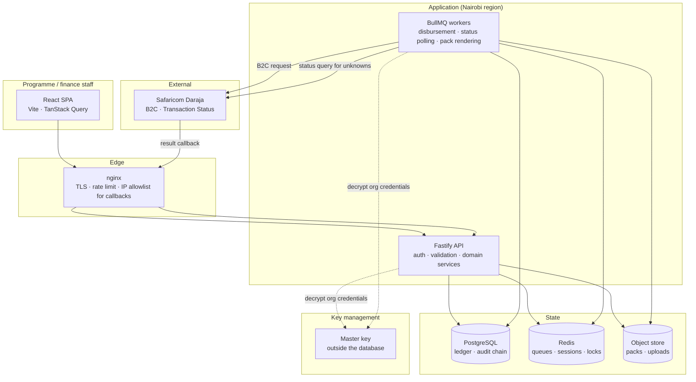
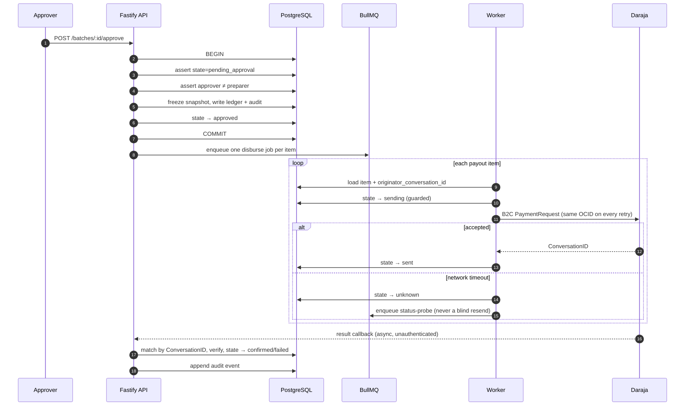
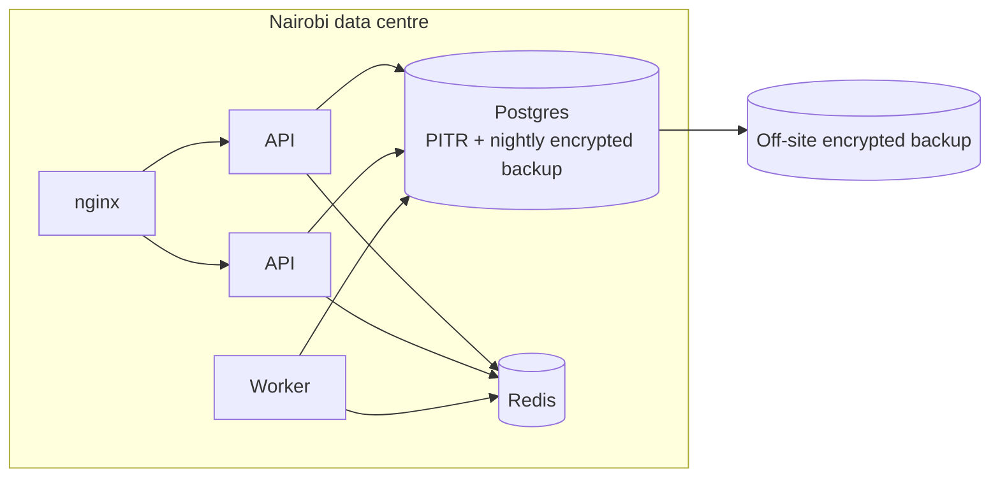

# 01. Architecture

## Shape of the system

A modular monolith with a separate worker process. One deployable API, one
deployable worker, one database. Not microservices: the transaction boundaries
in this domain are exactly where a service boundary would hurt most.



## Why a monolith

A payout batch is a single consistency domain. Reserving items, writing ledger
entries, appending audit events and advancing a state machine must be one
transaction or the system is not trustworthy. Splitting that across services buys
distributed-transaction problems in exchange for scaling we do not need. The
workload is hundreds of payments per cycle, not thousands per second.

The API and the worker share the domain layer as a library and differ only in
their entry point.

## Components

### Fastify API

Encapsulated plugins, one per bounded area. Every route declares a TypeBox schema
for params, body and response. No unvalidated data reaches the domain layer, and
the response schema stops PII leaking by accident.

```
src/
  domain/          pure logic: state machines, money, validation rules
  modules/
    auth/          sessions, MFA, roles
    orgs/          tenants, members, payout channels
    recipients/    people and their MSISDNs
    batches/       import, validation, approval, lifecycle
    disbursement/  Daraja adapter, idempotency, reconciliation
    packs/         reconciliation pack rendering
    audit/         append-only hash-chained log
  platform/        db, redis, queue, crypto, logging, config
```

`domain/` imports nothing from `modules/` or `platform/`. It is pure and directly
testable. That is where the double-pay logic lives, and it must be provable
without a database.

### Workers

Separate process, same codebase. Queues:

| Queue | Job | Concurrency | Notes |
| --- | --- | --- | --- |
| `disburse` | Send one B2C request | Low, rate-limited | Per-org limiter to respect Daraja throughput |
| `status-probe` | Query Transaction Status for an unknown item | Very low | Backoff: 1m, 5m, 15m, 1h, 6h |
| `pack-render` | Render reconciliation pack | 1–2 | Headless browser, memory-hungry |
| `notify` | Email/SMS notifications | Normal | Never blocks a payout |

**One payout item = one job.** Not one job per batch. A batch of 300 is 300 jobs,
so a single failure never poisons the rest and retries are surgical.

### Data

- **PostgreSQL**: everything that matters. Money, state, audit chain.
- **Redis**: queues, sessions, distributed locks. Treated as *disposable*: losing
  Redis must never lose a payout. Job state is reconstructable from Postgres.
- **Object store**: generated packs and original uploads. S3-compatible (MinIO
  self-hosted, or a regional provider). Encrypted at rest.

The rule: **if Redis and the object store both vanished, we could rebuild them
from Postgres.** Postgres is the only source of truth.

## Request flow: disbursing a batch



Step 8 is the whole design. Everything else is bookkeeping around the fact that
**a timeout is not a failure**: see [Payout lifecycle](04-payout-lifecycle.md).

## Failure model

| Failure | Behaviour |
| --- | --- |
| Daraja returns an error code | Item → `failed` with the code; batch continues |
| Daraja request times out | Item → `unknown`; probe via Transaction Status; never resend blind |
| Callback never arrives | Probe job resolves it; unresolved items block batch closure |
| Callback arrives twice | Idempotent by `ConversationID`; second is a no-op |
| Worker dies mid-job | Job returns to queue; state guard prevents double-send |
| Redis lost | Rebuild queues from Postgres items in non-terminal states |
| Postgres lost | Restore from PITR backup; **restore is tested quarterly** |
| Org credentials rotated mid-batch | Items fail cleanly; batch resumable after re-entry |

A batch **cannot be closed** while any item is `unknown`. Closure is what the
reconciliation pack certifies, so an unresolved payment must never be silently
rounded away.

## Deployment



Hosting sits in Kenya. This is a compliance decision, not a latency one: keeping
personal data in-country avoids the cross-border transfer obligations of the Data
Protection Act 2019 entirely, which is far cheaper than satisfying them. See
[Compliance](06-compliance.md#data-residency).

Two API instances for zero-downtime deploys. One worker to start; the queues are
already partitioned so it can be split later without code changes.

## What runs where

| Concern | API | Worker |
| --- | --- | --- |
| Authentication, authorisation | ✅ | n/a |
| Batch import and validation | ✅ | n/a |
| Approval (maker-checker) | ✅ | n/a |
| Outbound Daraja calls | n/a | ✅ |
| Inbound Daraja callbacks | ✅ | n/a |
| Status probing | n/a | ✅ |
| Pack rendering | n/a | ✅ |

Callbacks land on the API because they are HTTP requests from Safaricom that must
be answered fast; the API writes the result and returns `200` immediately. Any
follow-on work is enqueued.
