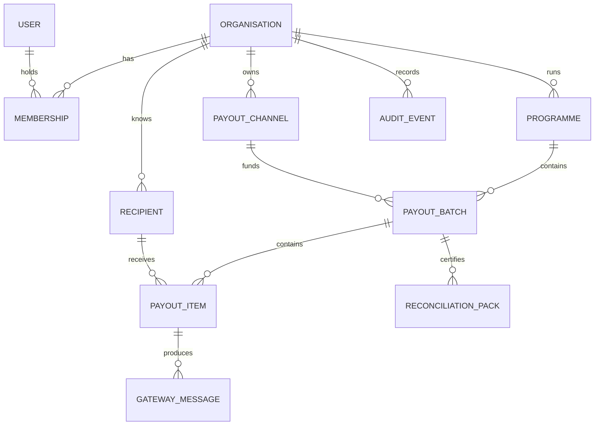
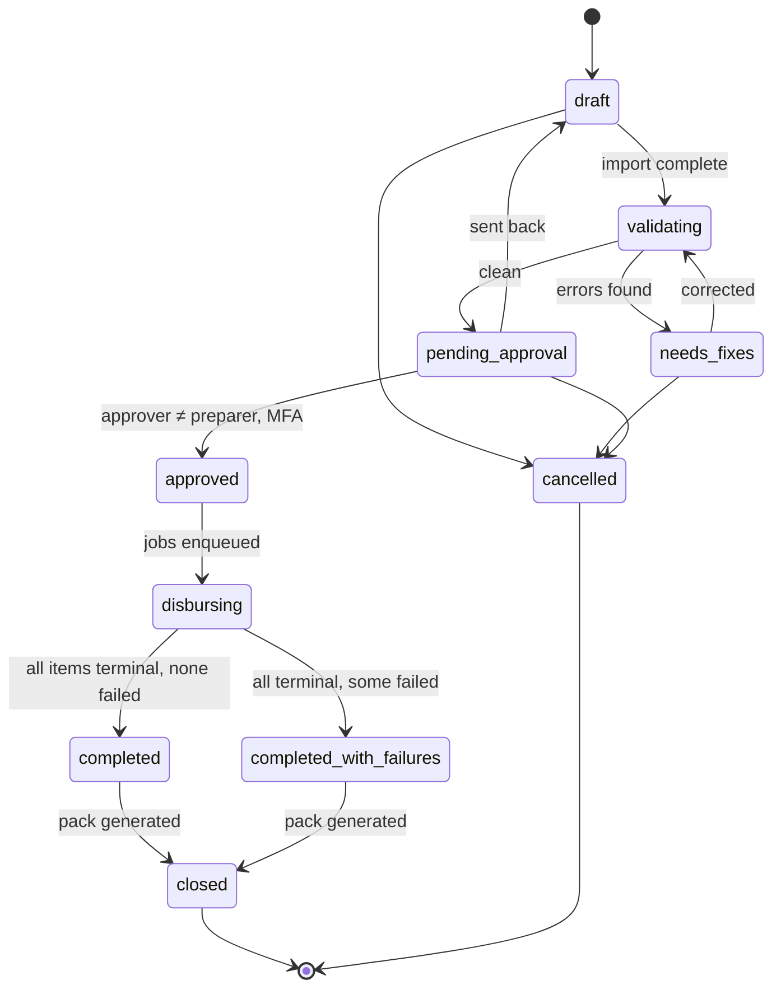
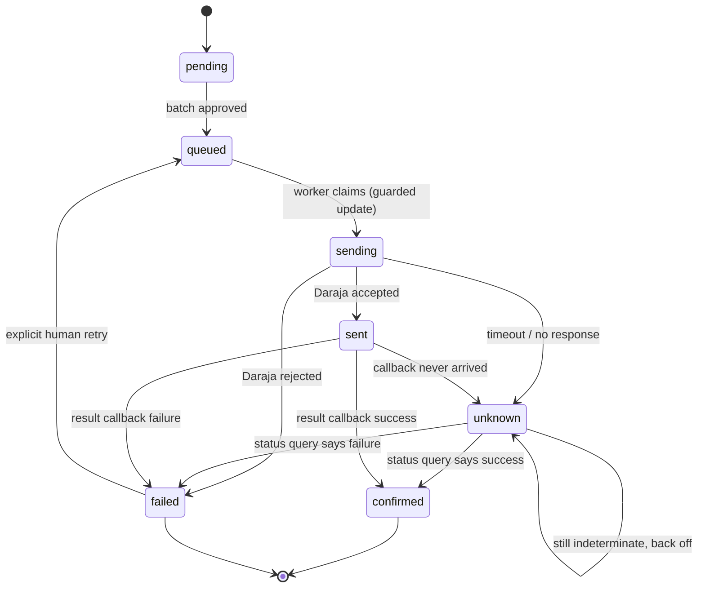

# 03. Data model

## Entities



## Core tables

### `organisation`

The tenant. Every other row hangs off this, and every query filters on it.

```sql
id              uuid primary key
name            text not null
odpc_reg_no     text                 -- data controller registration
retention_days  int not null default 2555   -- 7y, typical donor requirement
created_at      timestamptz not null default now()
```

### `payout_channel`

The organisation's own M-Pesa configuration. **This is the most sensitive table
in the system.**

```sql
id                    uuid primary key
organisation_id       uuid not null references organisation
label                 text not null
kind                  text not null check (kind in ('mpesa_b2c'))
shortcode             text not null
initiator_name        text not null
credentials_ciphertext bytea not null    -- envelope-encrypted, see 05-security
credentials_key_id    text not null      -- which master key wrapped it
callback_secret       text not null      -- unguessable path segment
is_active             boolean not null default true
verified_at           timestamptz
```

No plaintext secret ever lands in this table. See
[Security](05-security.md#credential-custody).

### `recipient`

```sql
id                uuid primary key
organisation_id   uuid not null references organisation
msisdn            text not null            -- E.164, normalised: 2547XXXXXXXX
full_name         text not null
national_id_enc   bytea                    -- optional, field-level encrypted
external_ref      text                     -- the org's own participant ID
created_at        timestamptz not null default now()

unique (organisation_id, msisdn)
```

`national_id` is **optional and encrypted**. Collect it only where the
organisation's own policy requires it. See
[Compliance](06-compliance.md#data-minimisation).

### `payout_batch`

```sql
id                 uuid primary key
organisation_id    uuid not null references organisation
programme_id       uuid not null references programme
payout_channel_id  uuid not null references payout_channel
reference          text not null            -- human handle, e.g. "YCIC-2026-03"
status             text not null
currency           char(3) not null default 'KES'
prepared_by        uuid not null references "user"
approved_by        uuid references "user"
approved_at        timestamptz
snapshot           jsonb                    -- frozen at approval
closed_at          timestamptz

unique (organisation_id, reference)
check (approved_by is null or approved_by <> prepared_by)   -- maker-checker
```

That last constraint is the maker-checker rule, enforced by the **database**, not
by application code. Application checks get bypassed; constraints do not.

### `payout_item`

```sql
id                          uuid primary key
batch_id                    uuid not null references payout_batch
recipient_id                uuid not null references recipient
amount_minor                bigint not null check (amount_minor > 0)
status                      text not null
originator_conversation_id  uuid not null,       -- generated ONCE, reused on retry
conversation_id             text,                -- returned by Daraja
mpesa_receipt               text,                -- the donor-facing proof
registered_name             text,                -- name M-Pesa says owns the line
failure_code                text,
failure_reason              text,
sent_at                     timestamptz,
settled_at                  timestamptz,
attempt_count               int not null default 0

unique (originator_conversation_id)
unique (batch_id, recipient_id)
check (amount_minor % 100 = 0)    -- see note: rail-specific, v1 only
```

Two unique constraints carry the anti-double-pay guarantee:

- `originator_conversation_id`: Safaricom deduplicates on this; we never
  regenerate it
- `(batch_id, recipient_id)`: one person cannot appear twice in one batch

**The whole-shilling check is rail-specific, and unconditional only because v1 has
exactly one rail.** M-Pesa B2C moves whole shillings; other rails do not. When a
second rail lands in Phase 3, denormalise `channel_kind` onto `payout_item`: it
is immutable for the life of a batch, and make the constraint conditional on it:

```sql
check (channel_kind <> 'mpesa_b2c' or amount_minor % 100 = 0)
```

Do not silently drop the constraint when adding a rail. Losing it would let a
fractional amount reach a gateway that rounds it.

### `gateway_message`

Every byte exchanged with Daraja, in both directions.

```sql
id               uuid primary key
payout_item_id   uuid references payout_item
recipient_id     uuid references recipient    -- whose key protects this payload
direction        text not null check (direction in ('outbound','inbound'))
kind             text not null       -- b2c_request | result_callback | status_query …
http_status      int
payload_enc      bytea not null      -- raw payload, encrypted under the recipient key
received_at      timestamptz not null default now()
```

Append-only. This is what you show an auditor, and what you read at 2am when a
payment is disputed. Never edit, never delete before the retention horizon.

**The payload is stored encrypted rather than as plaintext `jsonb`,** because it
contains MSISDNs and M-Pesa registered names while the table can never be updated
or deleted. That tension is resolved by crypto-shredding. See
[Erasure from append-only tables](#erasure-from-append-only-tables).

### `ledger_entry`

Immutable financial record. Append-only; corrections are new compensating rows,
never updates.

```sql
id              uuid primary key
organisation_id uuid not null references organisation
batch_id        uuid not null references payout_batch
payout_item_id  uuid references payout_item
entry_type      text not null   -- obligation | disbursed | reversed | failed
amount_minor    bigint not null
occurred_at     timestamptz not null default now()
```

### `audit_event`

Hash-chained, tamper-evident. You built this shape for ChildShield; it is the
same idea and it is the reason a donor can trust the pack.

```sql
id              bigserial primary key
organisation_id uuid not null references organisation
chain_seq       bigint not null          -- position in THIS org's chain, from 1
actor_user_id   uuid references "user"
action          text not null            -- batch.approved, item.confirmed …
subject_type    text not null
subject_id      uuid not null
metadata        jsonb not null default '{}'   -- references only, never raw PII
correlation_id  uuid
occurred_at     timestamptz not null default now()
prev_hash       bytea                    -- previous event OF THE SAME ORG
hash            bytea not null           -- H(prev_hash ‖ canonical(row))

unique (organisation_id, chain_seq)
```

Append-only, enforced with a trigger that rejects `UPDATE` and `DELETE`. Verify
the chain nightly and on every pack generation.

**The chain is per-organisation, not global.** One chain per tenant, each starting
at `chain_seq = 1`. This matters for three reasons:

- One organisation's retention deletion cannot break another's verification.
- A reconciliation pack only ever needs its own organisation's chain, so
  verification does not require reading across tenants, which would fight RLS.
- Verification cost stays bounded per tenant instead of growing with total
  platform volume.

**`metadata` holds references, never raw personal data.** Record `recipient_id`,
not a name or an MSISDN. This keeps the chain free of anything that could later
need erasing.

### `audit_checkpoint`

Verifying from genesis is fine in year one and painful in year seven. A daily
checkpoint per organisation makes verification incremental.

```sql
id              uuid primary key
organisation_id uuid not null references organisation
chain_seq       bigint not null      -- the event this checkpoint covers up to
hash            bytea not null       -- that event's hash
created_at      timestamptz not null default now()

unique (organisation_id, chain_seq)
```

Routine verification runs from the most recent checkpoint forward. Full
genesis-to-head verification runs monthly, and on demand for an auditor.

### `recipient_key`

The key that makes erasure possible without breaking append-only tables.

```sql
recipient_id    uuid primary key references recipient
key_ciphertext  bytea not null       -- data key, wrapped by the master key
key_id          text not null        -- which master key wrapped it
destroyed_at    timestamptz          -- set on erasure; row is kept
```

### Erasure from append-only tables

`gateway_message` and `audit_event` can never be updated or deleted. That is
what makes them evidence. But a recipient has a right to erasure, and
`gateway_message` payloads contain their MSISDN and registered name.

**The resolution is crypto-shredding.** Every payload that contains a recipient's
personal data is encrypted under a data key belonging to that recipient. Erasure
destroys the key, not the row:

1. Set `recipient_key.destroyed_at` and overwrite `key_ciphertext`.
2. Clear the identifying columns on `recipient` itself, which is a mutable table.
3. Leave `gateway_message` and `audit_event` untouched.

Afterwards the rows still exist, the hashes still verify, because the hash is
computed over the **ciphertext**: and the personal data inside them is
permanently unrecoverable. The financial record survives; the person does not
appear in it.

This is what makes the promise in
[Compliance](06-compliance.md#data-subject-rights) actually implementable rather
than aspirational.

## Money representation

One rule, applied everywhere:

> Money is a `BIGINT` count of **minor units**, always paired with a currency
> code. It is a **string** in JSON. It is never a float, and never a JavaScript
> `number` crossing a boundary.

KES 1,500.00 is `150000` with currency `KES`. JSON numbers are IEEE-754 doubles
and lose integer precision above 2^53; a string costs nothing and removes the
entire class of bug.

Because M-Pesa B2C moves whole shillings, a check constraint rejects fractional
amounts at write time rather than discovering them at disbursement time.

## State machines

### Batch



A batch **cannot leave `disbursing`** while any item is `unknown`. That is the
guard that keeps the pack honest.

### Item



`unknown` is a first-class state, not an error. A timeout means *we do not know
whether the money moved*, and the only safe response is to ask, never to resend.
This is expanded in [Payout lifecycle](04-payout-lifecycle.md).

## Indexes worth having from day one

```sql
create index on payout_item (batch_id, status);
create index on payout_item (status) where status in ('unknown','sending');
create unique index on payout_item (originator_conversation_id);
create index on payout_item (conversation_id);        -- callback lookup
create index on gateway_message (payout_item_id, received_at);
create index on audit_event (organisation_id, occurred_at desc);
create index on recipient (organisation_id, msisdn);
```

The partial index on `('unknown','sending')` powers the reconciliation sweep,
which is the query that runs most often and matters most.

## Multi-tenancy

Every tenant-scoped table carries `organisation_id`, and it appears in every
query. Enforced in two places:

1. A repository layer that requires an org-scoped context object. There is no
   way to call a query without one.
2. **PostgreSQL row-level security** as the backstop, with the app connecting as
   a role that has RLS enforced and `app.current_org` set per transaction.

Application-only isolation is one forgotten `WHERE` clause away from showing one
NGO another NGO's beneficiaries. RLS makes that a database error instead of a
breach notification.
