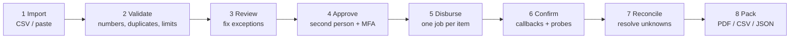
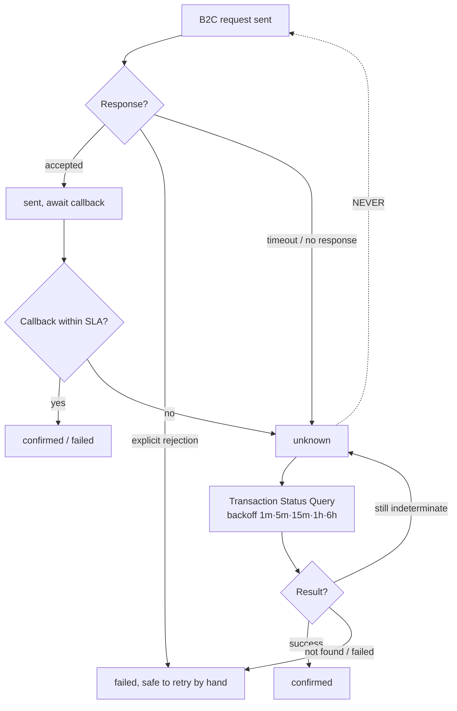

# 04. Payout lifecycle

The whole product is one flow. This document is the specification for it.



## 1: Import

Accept a CSV, an Excel paste, or a pull from a previous batch. Expected columns:
recipient reference, name, phone, amount, optional note.

Import is non-destructive: the original file is stored verbatim in the object
store and linked to the batch. When someone asks "what did we upload", the answer
is the actual bytes they uploaded.

## 2: Validate

Run every row through the same rules and classify each as **ok**, **warning** or
**blocking**.

| Check | Severity | Rationale |
| --- | --- | --- |
| MSISDN normalises to a valid Kenyan mobile | Blocking | `0712…`, `+254712…`, `254712…`, `7 12…` all normalise to `2547XXXXXXXX` |
| Amount is a positive whole shilling | Blocking | M-Pesa cannot move cents |
| Recipient appears once in the batch | Blocking | The classic double-pay source |
| Amount within per-item policy limit | Blocking | Catches the misplaced-decimal disaster |
| Batch total within per-batch limit | Blocking | Same, one level up |
| Name differs sharply from stored recipient name | Warning | Number may have been reassigned |
| Recipient is new to this organisation | Warning | Worth a human glance |
| Amount deviates > 50% from this recipient's usual | Warning | Catches fat-finger errors |
| Duplicate MSISDN under a different name | Warning | Two people, one phone: legitimate but check |

Blocking issues stop approval. Warnings must be individually acknowledged, and
the acknowledgement is recorded in the audit log with the user who made it.

The misplaced decimal is the single most expensive mistake in this domain:
`5000` typed as `50000` sends ten times the intended amount to someone who has no
obligation to return it. Per-item and per-batch limits are configured once, per
organisation, and cannot be raised by the same person who prepared the batch.

## 3: Review

The exception queue is the screen the customer will actually live in. It shows
blocking issues first, then warnings, then the clean rows collapsed.

Everything is editable in place; every edit is an audit event.

## 4: Approve

Maker-checker. The approver must not be the preparer (enforced by a database
constraint, not a code path) and must pass a step-up MFA challenge at the moment
of approval regardless of session age.

On approval, in **one transaction**:

1. Assert `status = 'pending_approval'`
2. Assert `approver ≠ preparer`
3. Freeze a `snapshot` of every item into the batch row
4. Write `obligation` ledger entries
5. Generate an `originator_conversation_id` for every item, **once, now, forever**
6. Advance batch to `approved`, items to `queued`
7. Append the audit event

Jobs are enqueued **after** the transaction commits. Enqueuing inside the
transaction risks a worker picking up a job for a row that then rolls back.

The frozen snapshot is what the reconciliation pack is generated against, so
later edits to a recipient's name cannot rewrite history.

## 5: Disburse

One job per item. The worker:

```
claim item with a guarded update:
    UPDATE payout_item SET status='sending'
     WHERE id=$1 AND status='queued'
    RETURNING *
  → no row? another worker has it, or it is no longer eligible. exit quietly.

load and decrypt the organisation's channel credentials
POST B2C PaymentRequest, using the item's EXISTING originator_conversation_id
persist the raw request and response to gateway_message

  accepted  → store ConversationID, status='sent'
  rejected  → status='failed', record code and reason
  timeout   → status='unknown', enqueue status-probe
```

Rate limited per organisation, because Daraja throttles and a burst of 300
requests will get part of the batch rejected for the wrong reason.

## 6: Confirm

Daraja calls the result URL asynchronously. The handler:

1. Finds the item by `ConversationID`
2. Persists the raw callback to `gateway_message` **before** interpreting it
3. If the item is already terminal, no-ops: callbacks can arrive twice
4. Otherwise records `ResultCode`, the M-Pesa receipt, the **registered name** of
   the receiving line, and moves to `confirmed` or `failed`
5. Appends an audit event
6. Returns `200` immediately; anything slow is enqueued

The registered name is worth capturing deliberately. M-Pesa tells you the name
registered to the number that was paid. Comparing it to the intended recipient
name catches transposed digits and reassigned SIMs *after* the fact, and a
recurring mismatch is a fraud signal. Surface it in the pack.

## The double-pay problem

This is the part to get right. Everything else is recoverable; this is not.

> **A timeout is not a failure.** When a B2C request times out, the money may
> have moved. Resending is how organisations pay people twice.

Rules, in order of importance:

1. **`originator_conversation_id` is generated once, at approval, and never
   regenerated.** Every retry reuses it. Safaricom deduplicates on it, so a
   genuine duplicate request is rejected rather than paid.
2. **Never blind-retry a timeout.** A timeout enqueues a *status probe*, never a
   resend.
3. **Only `failed` with an explicit, non-ambiguous failure code is retryable**,
   and only by human action. A retry moves the item `failed → queued`, so it
   re-enters through the same guarded claim as everything else: `queued` is the
   only state a worker can ever claim from. There is no separate retryable state.
4. **`unknown` blocks batch closure.** The pack cannot be generated over a
   payment whose outcome nobody knows.
5. **The state guard makes double-send structurally impossible**, because only
   one worker can move an item out of `queued`.



The dotted line is the edge that must not exist in the code. Write the property
test that asserts it before writing the feature.

## 7: Reconcile

A sweep runs on a schedule over every non-terminal item:

- `sent` with no callback past the SLA → `unknown`, probe
- `unknown` → probe, with backoff
- Anything unresolved past 24h → raise a human exception

The exception screen lists every item the system could not resolve by itself,
with the raw gateway messages attached, so a human can call Safaricom with a
`ConversationID` in hand.

## 8: Pack

Once every item is terminal, the batch can be closed and the reconciliation pack
generated. See [Reconciliation & audit](07-reconciliation-and-audit.md).

## Invariants

These hold at all times, and each has a test:

1. The sum of `confirmed` item amounts equals the sum of `disbursed` ledger
   entries for the batch.
2. No two items in a batch share a recipient.
3. No `originator_conversation_id` appears on two items, ever.
4. No batch reaches `closed` with a non-terminal item.
5. An `audit_event` exists for every state transition of every batch and item.
6. The audit hash chain verifies from genesis.
7. No item transitions out of a terminal state except `failed → queued` by
   explicit human retry.
